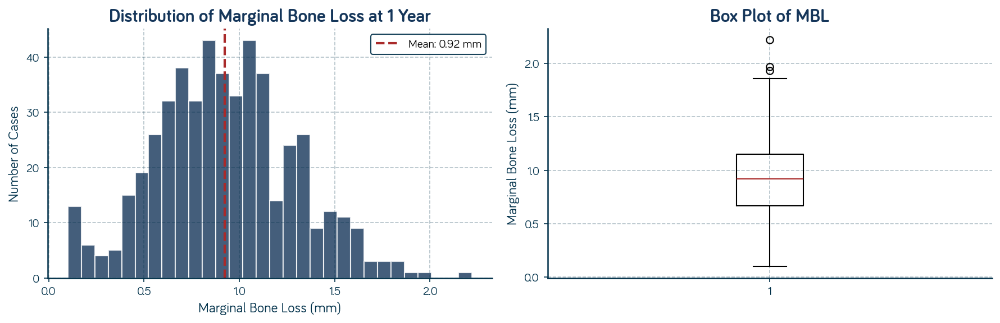
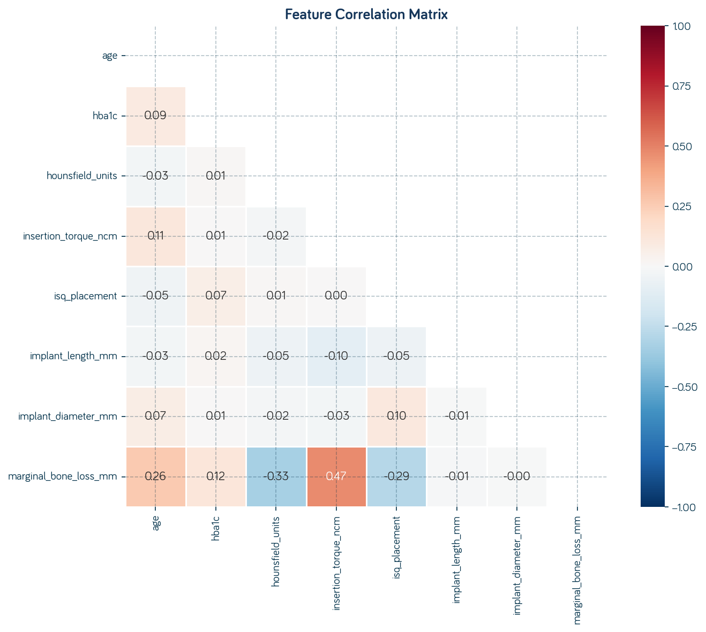
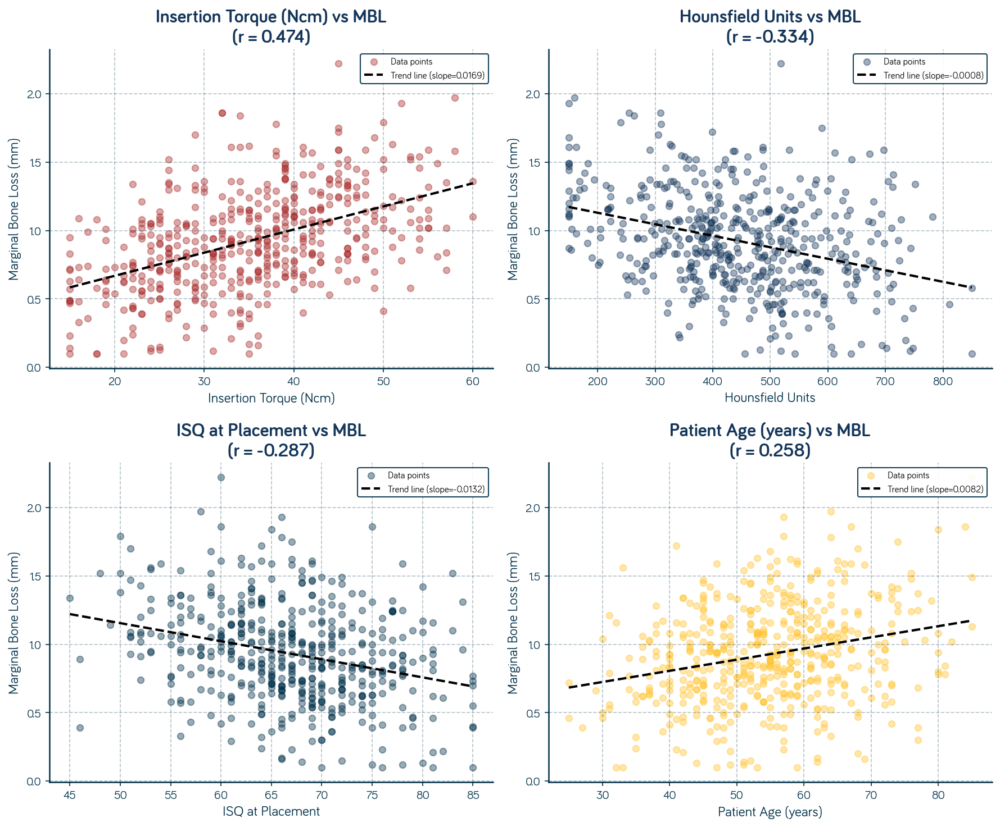
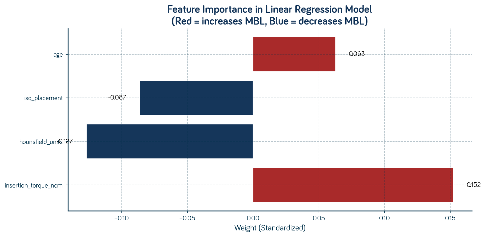
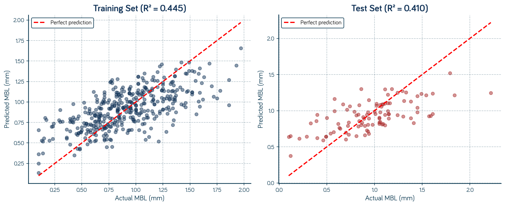
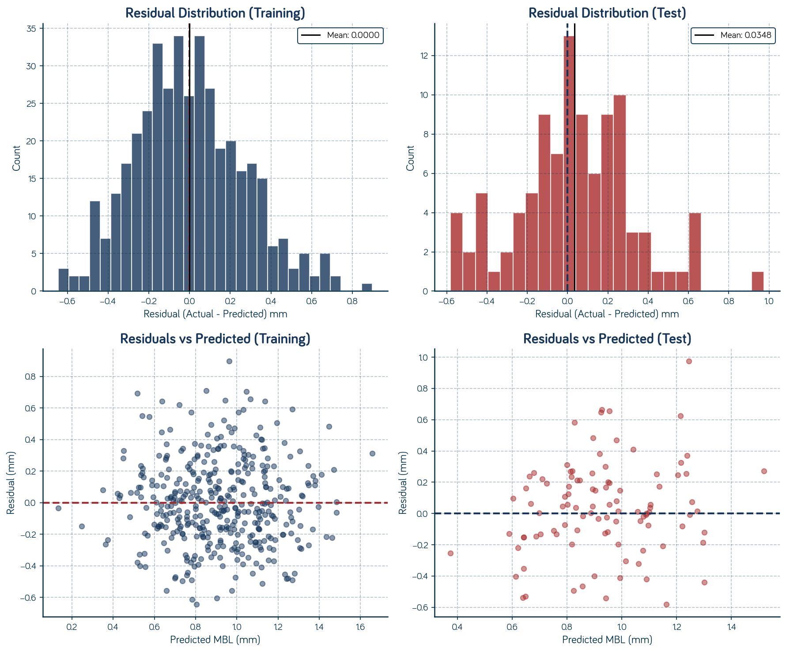

# Chapter 03 — Linear Regression: Predicting Numbers from Patterns

> **Book**: Machine Learning For Dentists: From Torque To Tensors

---

## Clinical Scenario

> Dr. Helena Soares studies the CBCT on her screen, measuring the available bone at site #36. Her patient — a 58-year-old woman with well-controlled Type 2 diabetes — has adequate height but questionable density. The Hounsfield units read 380.
>
> Helena has placed over 400 implants in her career. She knows this case will integrate. But her patient asks a reasonable question: "How much bone will I lose around the implant in the first year?"
>
> Helena pauses. She could quote literature averages — 0.5 to 1.5 mm of marginal bone loss — but those numbers come from populations, not from *this* patient with *this* bone density, *this* torque value, *this* ISQ reading. She wishes she had a way to give a more personalized estimate.
>
> This is the question that **linear regression** helps answer: predicting a *specific number* — like expected marginal bone loss — from a combination of measurable patient and surgical factors.

---

## What This Chapter Covers

After reading this chapter and completing the codelab, you will be able to:

1. **Explain** what linear regression does in plain language — and why it matters for clinical prediction

2. **Identify** when linear regression is (and isn't) appropriate for your clinical questions

3. **Interpret** the key outputs: weights, bias, and what they tell you about feature importance

4. **Apply** linear regression to a simple tabular dataset in Python

5. **Critically evaluate** the limitations: when a straight line isn't enough, and what can go wrong

---

## Intuition: What Does Linear Regression Actually Do?

### The Core Idea

Imagine you're trying to predict something you can measure — not a category like "success" or "failure," but an actual number. How many millimeters of bone loss? What ISQ value at 6 months? How long until osseointegration?

Linear regression finds the best "straight-line" (or "flat-plane" with multiple inputs) relationship between your input measurements and the number you want to predict.

Think of it like this: you have historical data from 500 implant cases. For each case, you recorded the insertion torque, ISQ at placement, and Hounsfield units. You also measured the marginal bone loss after one year. Linear regression looks at all 500 cases and finds the formula that best predicts bone loss from those three inputs.

The result? A simple equation you can use on *new* patients:

```
Predicted MBL = (weight₁ × Torque) + (weight₂ × ISQ) + (weight₃ × HU) + bias
```

The "weights" tell you how much each factor contributes. The "bias" is a baseline adjustment. Together, they give you a personalized prediction.

### A Concrete Example

Let's make this tangible. Suppose after training on your 500 cases, the model learned these values:

| Parameter | Learned Value | Clinical Meaning |
|-----------|---------------|------------------|
| w_torque | 0.02 | Each Ncm of torque adds 0.02 mm to predicted MBL |
| w_ISQ | -0.01 | Each ISQ point *reduces* predicted MBL by 0.01 mm |
| w_HU | -0.001 | Each HU of density *reduces* predicted MBL by 0.001 mm |
| bias | 1.5 | Baseline expected MBL when all features are zero |

Now Dr. Helena's patient arrives with:

- Torque: 35 Ncm
- ISQ: 72
- HU: 380

**Predicted MBL** = (0.02 × 35) + (-0.01 × 72) + (-0.001 × 380) + 1.5  
= 0.70 - 0.72 - 0.38 + 1.5  
= **1.10 mm**

Helena can now tell her patient: "Based on cases similar to yours, I'd expect about 1.1 mm of bone remodeling in the first year — that's within the normal range."

### When Would You Use This?

Linear regression shines when:

1. **You're predicting a continuous number** — bone loss in mm, healing time in weeks, ISQ at follow-up

2. **You have measurable inputs** — clinical variables like torque, probing depth, HbA1c, patient age

3. **You suspect a roughly linear relationship** — more torque generally means more bone loss (within a range)

### When Would You NOT Use This?

Linear regression is the wrong tool when:

1. **You're predicting categories** — success vs. failure, healthy vs. diseased (use logistic regression instead)

2. **The relationship is clearly curved** — for example, if moderate torque is optimal and both very low AND very high torque lead to problems

3. **You have very few data points** — linear regression needs enough cases to find reliable patterns

---

## The Math (Just Enough)

### The Key Formula

At its heart, linear regression is beautifully simple:

$$
\hat{y} = w_1 x_1 + w_2 x_2 + ... + w_D x_D + b
$$

Or more compactly:

$$
\hat{y} = \mathbf{w} \cdot \mathbf{x} + b
$$

**What each piece means:**

- **ŷ (y-hat)**: The predicted value — what the model thinks the outcome will be
- **x₁, x₂, ... x_D**: Your input features (e.g., Torque, ISQ, HU) — there are D of them
- **w₁, w₂, ... w_D**: The weights — learned numbers that tell you how much each feature matters
- **b (bias)**: A constant offset — the prediction when all features are zero
- **w · x**: The dot product — multiply each feature by its weight, then sum them up

### Why This Formula Behaves the Way It Does

The formula is deliberately simple. If you increase Torque by 10 Ncm, and w_torque = 0.02, then your prediction increases by exactly 0.2 mm. The effect is *linear* — double the change in input, double the change in output.

This simplicity is both a strength (easy to interpret) and a limitation (can't capture curved relationships without modifications).

### A Worked Example with Realistic Numbers

Let's walk through predicting an "Implant Success Score" (a hypothetical 0-100 scale) from three features:

**Given (after training):**

- w_HU = 0.05 (per Hounsfield unit)
- w_Torque = 0.8 (per Ncm)
- w_BIC = 0.3 (per percentage point)
- b = 20 (baseline score)

**New patient measurements:**

- HU = 450
- Torque = 35 Ncm
- BIC = 60%

**Calculation:**

$$
\text{Score} = (0.05 \times 450) + (0.8 \times 35) + (0.3 \times 60) + 20
$$

$$
= 22.5 + 28 + 18 + 20 = 88.5
$$

This patient's predicted implant success score is **88.5 out of 100**.

---

## Going Deeper: How the Model Learns

### The Training Process

Where do those weights and bias come from? The model *learns* them from your historical data.

Here's the key insight: the model starts with random weights (or zeros), makes predictions on your training data, sees how wrong those predictions are, and then adjusts the weights to be less wrong. It repeats this process thousands of times until the predictions stop improving.

### The Loss Function: Measuring "Wrongness"

How does the model know how wrong it is? It uses a **loss function** — specifically, the **Mean Squared Error (MSE)**:

$$
\text{MSE} = \frac{1}{N} \sum_{i=1}^{N} (y_i - \hat{y}_i)^2
$$

In plain language: for each of your N training cases, calculate the difference between the actual outcome (yᵢ) and the predicted outcome (ŷᵢ), square that difference, then average all the squared differences.

**Why squared?** Two reasons:

1. Squaring makes all errors positive (a prediction 2 mm too high is just as "wrong" as 2 mm too low)
2. Squaring penalizes large errors more than small ones (being off by 4 mm is punished 16×, not 4×)

### Gradient Descent: The Learning Algorithm

The model adjusts weights using **gradient descent**. Think of it like finding the lowest point in a valley while blindfolded:

1. Feel which direction slopes downward (compute the gradient)
2. Take a small step in that direction (update the weights)
3. Repeat until you can't go any lower (convergence)

The formula for updating each weight:

$$
w_{new} = w_{old} - \eta \cdot \frac{\partial \text{MSE}}{\partial w}
$$

Where η (eta) is the **learning rate** — how big a step you take. Too big, and you overshoot; too small, and training takes forever.

---

## Key Hyperparameters and Trade-offs

### What You Can Control

| Parameter | What It Controls | Typical Values | Clinical Analogy |
|-----------|------------------|----------------|------------------|
| Learning rate (η) | Step size during training | 0.001 - 0.1 | Like adjusting torque incrementally vs. jumping to final value |
| Number of iterations | How long to train | 1000 - 100,000 | Like follow-up duration — too short misses patterns |
| Regularization (λ) | Penalty for large weights | 0.001 - 1.0 | Like being conservative — prevents overconfidence |

### Common Pitfalls

1. **Interpreting raw weights as importance**
   
   If w_torque = 0.8 and w_HU = 0.05, it's tempting to say "Torque matters 16× more than bone density!" But that's only true if both features are on the same scale. If Torque ranges from 20-50 Ncm and HU ranges from 200-800, you're comparing apples to oranges.
   
   **Solution:** Standardize your features before training (convert to z-scores), or use the actual contribution (weight × typical value).

2. **Ignoring multicollinearity**
   
   If two features are highly correlated (like implant length and surface area), the model struggles to determine which one actually matters. The weights become unstable.
   
   **Solution:** Check correlations between features. Consider dropping one of highly correlated pairs.

3. **Assuming linearity when it doesn't exist**
   
   If the true relationship is curved — for example, if *moderate* torque is best and both extremes are bad — a straight line will miss this entirely.
   
   **Solution:** Plot your features against outcomes before modeling. If you see curves, consider polynomial features or a different model.

### Strengths and Weaknesses

**Strengths:**

- Simple and interpretable — you can explain exactly how a prediction was made
- Computationally efficient — trains in seconds, even on large datasets
- Rarely overfits — the model is too simple to memorize noise
- Great baseline — always try linear regression first to set expectations

**Weaknesses:**

- Assumes linear relationships — misses curves and interactions
- Sensitive to outliers — one extreme case can pull the entire line
- Requires feature scaling for fair weight comparison
- Can't capture threshold effects (e.g., "torque above X suddenly matters more")

---

## The Codelab

> See `03_linear_regression.ipynb` in this folder for a hands-on walkthrough.

**What you'll do:**

1. Load a synthetic dataset of implant cases with features: Hounsfield Units, Insertion Torque, ISQ at placement
2. Explore the data: distributions, correlations, potential issues
3. Preprocess: handle missing values, scale features
4. Train a linear regression model using scikit-learn
5. Evaluate performance: MSE, R² score
6. Interpret the weights: what does the model think matters most?
7. Make predictions on new, hypothetical patients

**Prerequisites:** Basic Python familiarity. If you haven't completed Chapter 02 (Math Foundations), do that first — you'll need to understand vectors, derivatives, and the intuition behind gradient descent.

---

## Codelab Results: What the Data Reveals

### The Target Variable: Marginal Bone Loss

Our synthetic dataset contains 500 implant cases. The target variable — marginal bone loss at 1 year — follows a roughly normal distribution centered around 0.92 mm:

<div align="center">

</div>

**Key observations:**
- Mean MBL: 0.92 mm (within the clinically acceptable range)
- Most cases fall between 0.5 and 1.5 mm
- A few outliers show higher bone loss (>1.8 mm) — these are the cases we want to predict!

### Feature Correlations

Before modeling, we check how our features relate to each other and to the target:

<div align="center">

</div>

**What the correlations reveal:**

| Feature | Correlation with MBL | Interpretation |
|---------|---------------------|----------------|
| `insertion_torque_ncm` | +0.47 ↑ | Higher torque → More bone loss |
| `hounsfield_units` | -0.33 ↓ | Denser bone → Less bone loss |
| `isq_placement` | -0.29 ↓ | Better stability → Less bone loss |
| `age` | +0.26 ↑ | Older patients → More bone loss |

These correlations align with clinical intuition — and give us confidence the model will find meaningful patterns.

### Visualizing the Relationships

Before training, let's see what these relationships look like. Each scatter plot shows one feature vs. bone loss, with a trend line:

<div align="center">

</div>

**What we see:**
- **Insertion torque** (top-left): Clear positive slope — higher torque correlates with more bone loss
- **Hounsfield units** (top-right): Negative slope — denser bone, less bone loss
- **ISQ** (bottom-left): Negative slope — better stability, less bone loss
- **Age** (bottom-right): Weak positive slope — age has a smaller effect

These visual patterns confirm our correlation analysis and justify using linear regression.

### Feature Importance: What the Model Learned

After training, we can visualize how much each feature contributes to the prediction:

<div align="center">

</div>

**Interpreting the weights (standardized):**

- **Insertion torque** (+0.152): The strongest positive predictor. Higher torque → more predicted bone loss.
- **Hounsfield units** (-0.127): Denser bone protects against bone loss.
- **ISQ** (-0.087): Better primary stability → less bone loss.
- **Age** (+0.063): Older patients have slightly more predicted bone loss.

**Clinical insight:** The model suggests that over-torquing implants (even within "safe" ranges) may contribute more to bone loss than patient age. This is a hypothesis worth investigating with real data!

### Model Performance: Predicted vs. Actual

How well does the model actually predict? We evaluate on held-out test data:

<div align="center">

</div>

**Performance metrics:**
- **R² = 0.41** — The model explains ~41% of variance in bone loss
- **RMSE ≈ 0.23 mm** — Average prediction error

**What this means clinically:**
- The model captures meaningful signal — predictions correlate with reality
- But ~59% of variance remains unexplained (unmeasured factors, random variation)
- Average error of ±0.23 mm is useful for counseling, not precise diagnosis

### Checking Our Assumptions: Residual Analysis

A good linear regression model should have **residuals** (prediction errors) that are:
- Centered around zero
- Roughly normally distributed
- Showing no pattern when plotted against predictions

<div align="center">

</div>

**What the residuals tell us:**
- **Top row**: Residual distributions are symmetric and centered at zero — ✓ good!
- **Bottom row**: Residuals show random scatter around zero line — ✓ no systematic bias!
- **No funnel shape**: Variance is roughly constant — ✓ homoscedasticity assumption met!

This confirms our linear regression model is appropriate for this data.

---

## Clinical Reflection

### What Can This Model Tell Us?

A well-trained linear regression model can:

- **Provide personalized estimates** based on individual patient characteristics
- **Identify influential factors** — which variables most strongly predict the outcome
- **Quantify uncertainty** — confidence intervals tell you how much to trust the prediction
- **Reveal surprising relationships** — maybe a factor you thought was important isn't, or vice versa

### What Can't It Tell Us?

Linear regression has real limits:

- **Correlation is not causation.** If high ISQ correlates with success, that doesn't mean artificially increasing ISQ (somehow) would improve outcomes. There could be a confounding factor.

- **It captures averages, not individual variation.** Two patients with identical measurements might have different outcomes due to unmeasured factors.

- **It assumes the future resembles the past.** If your training data came from one clinic's population, the model may not generalize to a different demographic.

- **It can't handle categorical outcomes.** "Success" vs "Failure" requires a different model (logistic regression, covered in Chapter 04).

### The Bias Question

**Where could bias hide in this analysis?**

- **In the data:** If your training cases were mostly from healthy, non-smoking patients under 60, the model may perform poorly on older, medically complex patients.

- **In the features:** If you only measured clinical variables and ignored socioeconomic factors that affect healing (access to follow-up care, nutrition), your predictions will be incomplete.

- **In the outcome definition:** "Marginal bone loss" measured differently across studies. If your training data mixed measurement protocols, the model learns from noise.

### Before Using in Practice

A responsible clinician should ask:

1. **Was this model validated on a population similar to my patients?** A model trained in Germany may not apply in Brazil.

2. **What is the prediction error in realistic terms?** If the model's average error is ±0.8 mm, and the difference between "acceptable" and "concerning" bone loss is 0.5 mm, the model may not be clinically useful.

3. **Does this replace clinical judgment, or augment it?** Linear regression provides *one input* to your decision, not the final answer.

---

## Key Takeaways

1. **Linear regression predicts a number from inputs using a simple weighted sum** — it finds the best straight-line (or flat-plane) relationship in your data.

2. **The model learns weights by minimizing prediction errors** — specifically, the Mean Squared Error, using gradient descent to iteratively improve.

3. **Weights tell you about feature importance, but only if features are scaled** — raw weight comparison is misleading when features have different ranges.

4. **Simplicity is both strength and limitation** — easy to interpret, hard to overfit, but can't capture curved relationships or threshold effects.

5. **Always validate on held-out data and populations similar to your patients** — a model is only as good as its generalization to new cases.

---

## Further Reading

- **Burkov, A. (2019).** *The Hundred-Page Machine Learning Book.* Chapter 3 covers linear regression with mathematical rigor and practical examples.

- **Géron, A. (2022).** *Hands-On Machine Learning with Scikit-Learn, Keras, and TensorFlow.* Chapter 4 provides Python implementation details.

- **Brizuela, A. et al. (2015).** Influence of insertion torque on implant stability. *Clinical Oral Implants Research.* — A reminder that clinical relationships are rarely purely linear.

- **scikit-learn documentation:** [Linear Models](https://scikit-learn.org/stable/modules/linear_model.html) — Reference for implementation.

---

## Next Chapter

In **Chapter 04 — Logistic Regression**, we'll tackle a different question: not "how much?" but "which category?" Dr. Marco Ferreira needs to decide whether to load an implant now or wait. He doesn't need a number — he needs a probability of success. Logistic regression builds directly on what we learned here, adding one crucial twist: the sigmoid function that converts any number into a probability between 0 and 1.

---

*Questions or feedback? Open an issue on the book's GitHub repository or reach out on Twitter @cisco_research*
