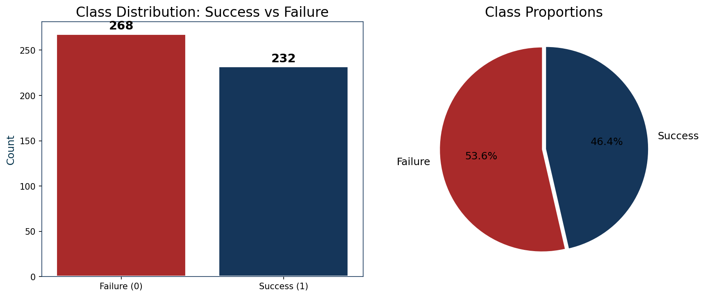
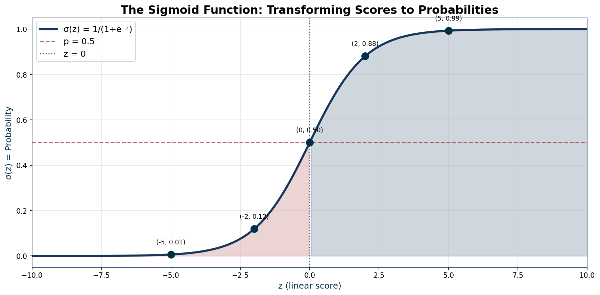
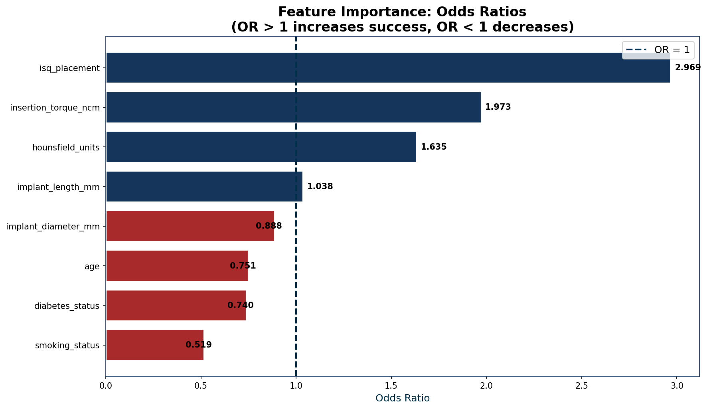
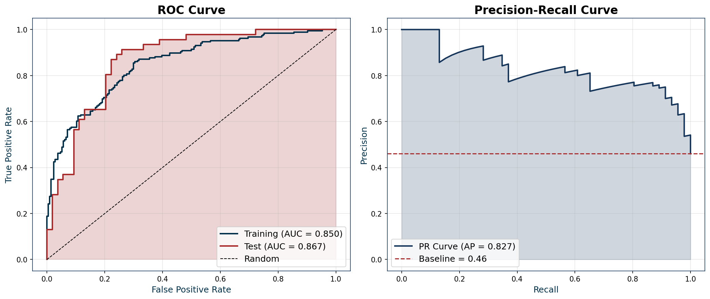
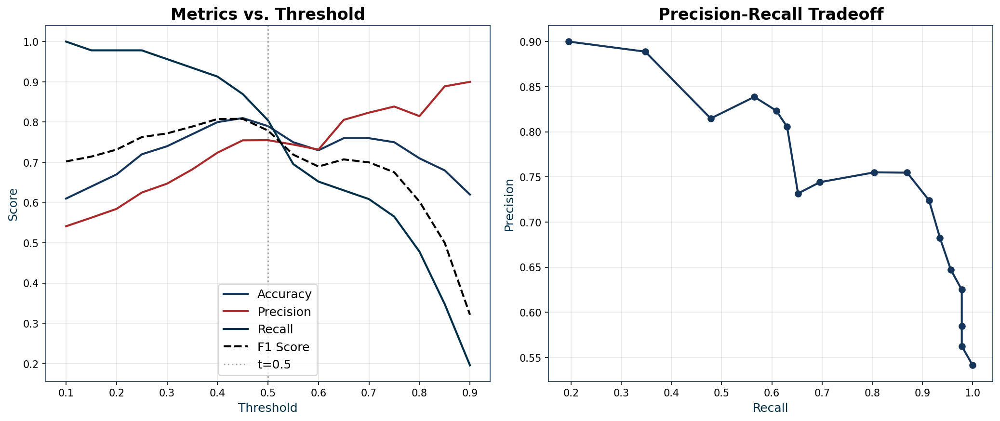

# Chapter 04 — Logistic Regression: When the Answer is Yes or No

> **Book**: Machine Learning For Dentists: From Torque To Tensors

---

## Clinical Scenario

> Dr. Marco Ferreira reviews the 3-month post-operative radiograph on his screen. The implant at site #36 looks stable — no radiolucency, good bone-to-implant contact on the image. His Osstell reading shows an ISQ of 68, and he recorded an insertion torque of 32 Ncm at placement.
>
> The patient, a 45-year-old non-smoker with no systemic conditions, is eager to get her final crown. "Can we load it today, doctor?"
>
> Marco hesitates. The numbers look reasonable, but not exceptional. The literature gives him ranges and protocols, but not a clear answer for *this* patient with *these* specific values. He's seen similar cases succeed beautifully — and he's seen a few fail unexpectedly.
>
> What he really wants isn't a number like "0.92 mm of bone loss." He wants a probability: *What are the chances this implant will succeed if I load it now versus waiting another 8 weeks?*
>
> This is a fundamentally different question than what linear regression answers. We're not predicting *how much* — we're predicting *which category*: success or failure, yes or no, load now or wait.
>
> This is the question that **logistic regression** helps answer.

---

## What This Chapter Covers

After reading this chapter and completing the codelab, you will be able to:

1. **Explain** how logistic regression transforms a linear score into a probability

2. **Identify** when to use logistic regression instead of linear regression

3. **Interpret** the outputs: probabilities, odds ratios, and what the weights actually mean

4. **Understand** how to choose a decision threshold — and why 0.5 isn't always right

5. **Recognize** the pitfalls: imbalanced classes, complete separation, and the linearity assumption you didn't know existed

---

## Intuition: From Numbers to Categories

### The Core Problem

In Chapter 03, we used linear regression to predict a continuous number — marginal bone loss in millimeters. The model gave us an equation:

$$
\hat{y} = w_1 x_1 + w_2 x_2 + ... + b
$$

But what if our question isn't "how much?" but "which one?"

- Will this implant **succeed** or **fail**?
- Does this patient have **periodontal disease** or not?
- Is this lesion **malignant** or **benign**?

These are **classification** problems. The answer isn't a number on a continuous scale — it's a category.

### The Clever Trick: Two Steps

Logistic regression solves this with an elegant two-step process:

**Step 1: Calculate a score (just like linear regression)**

We still compute the familiar weighted sum:

$$
z = w_1 x_1 + w_2 x_2 + ... + b
$$

This gives us a number that could be anything: -50, 0, 3.7, 102. Just like before.

**Step 2: Squeeze the score into a probability**

Here's the magic. We take that score *z* and pass it through the **sigmoid function**:

$$
\sigma(z) = \frac{1}{1 + e^{-z}}
$$

This function has a remarkable property: no matter what number you feed it — whether z is -1000 or +1000 — the output is always between 0 and 1.

That output *is* a probability. We can interpret it as: "The model estimates a 73% chance of success" or "The model estimates a 12% chance of disease."

### The Sigmoid's Shape

The sigmoid function looks like an elongated S:

- When z is very negative (say, -10), σ(z) approaches 0
- When z is very positive (say, +10), σ(z) approaches 1
- When z = 0, σ(z) = exactly 0.5

This shape is perfect for our purpose. It smoothly transitions between "almost certainly no" and "almost certainly yes," with a region of uncertainty in the middle.

### A Concrete Example

Let's return to Dr. Marco's patient. Suppose after training on historical implant data, the model learned:

| Parameter | Learned Value |
|-----------|---------------|
| w_torque | 0.08 |
| w_ISQ | 0.12 |
| b | -10.5 |

Marco's patient has:

- Insertion Torque: 32 Ncm
- ISQ: 68

**Step 1: Calculate z**

$$
z = (0.08 \times 32) + (0.12 \times 68) + (-10.5)
$$

$$
z = 2.56 + 8.16 - 10.5 = 0.22
$$

**Step 2: Apply sigmoid**

$$
\sigma(0.22) = \frac{1}{1 + e^{-0.22}} = \frac{1}{1 + 0.80} = \frac{1}{1.80} = 0.555
$$

The model estimates a **55.5% probability of success**.

That's not a resounding "yes" — it's barely above the typical 0.5 threshold. Marco might reasonably decide to wait a few more weeks, or he might consider this acceptable given other clinical factors the model doesn't capture.

### When Would You Use This?

Logistic regression is the right tool when:

1. **You're predicting a binary outcome** — success/failure, disease/healthy, yes/no

2. **You want probabilities, not just categories** — knowing it's "73% likely" is more useful than just "yes"

3. **Interpretability matters** — you need to explain *why* the model made its prediction

### When Would You NOT Use This?

Logistic regression struggles when:

1. **The outcome has more than two categories** — use multinomial logistic regression or other classifiers

2. **The relationship between features and outcome is highly nonlinear** — the sigmoid can only do so much

3. **You're predicting a continuous number** — use linear regression instead

---

## The Math (Just Enough)

### The Key Formulas

**The model itself (for prediction):**

$$
P(y=1|x) = \sigma(w \cdot x + b) = \frac{1}{1 + e^{-(w \cdot x + b)}}
$$

This reads: "The probability that y equals 1, given the input x, is the sigmoid of the weighted sum."

**What each piece means:**

- **P(y=1|x)**: The probability of the positive class (success, disease, yes)
- **w · x + b**: The same linear combination from linear regression — we call this *z*
- **σ(z)**: The sigmoid function that squashes z into [0, 1]
- **e**: Euler's number (~2.718), the base of natural logarithms

### The Loss Function: Binary Cross-Entropy

In linear regression, we minimized Mean Squared Error. For logistic regression, we use a different loss function: **Binary Cross-Entropy** (BCE).

$$
\text{Loss} = -\frac{1}{N} \sum_{i=1}^{N} \left[ y_i \log(p_i) + (1 - y_i) \log(1 - p_i) \right]
$$

This looks intimidating, but it's actually intuitive. Let's break it down:

**When the true label is 1 (success):**

- The loss simplifies to: $-\log(p_i)$
- If the model predicts high probability (p close to 1), loss is low ✓
- If the model predicts low probability (p close to 0), loss is high ✗

**When the true label is 0 (failure):**

- The loss simplifies to: $-\log(1 - p_i)$
- If the model predicts low probability (p close to 0), loss is low ✓
- If the model predicts high probability (p close to 1), loss is high ✗

The model learns by adjusting weights to minimize this loss — penalizing confident wrong predictions more than uncertain ones.

### Why Not Just Use MSE?

You might wonder: why not use Mean Squared Error like we did for linear regression?

The answer is mathematical convenience and optimization stability. The BCE loss function creates a "smoother" optimization landscape for gradient descent when the output is a probability. MSE with sigmoid outputs creates flat regions where learning stalls.

---

## Going Deeper: What the Weights Really Mean

### The Linearity Assumption You Didn't Know About

Here's something that confuses even experienced practitioners: logistic regression **does** assume a linear relationship — but not where you might expect.

The sigmoid curve is clearly nonlinear. So what's linear?

The relationship between features and the **log-odds** is linear:

$$
\log\left(\frac{p}{1-p}\right) = w \cdot x + b
$$

The term on the left — log(p / (1-p)) — is called the **logit** or log-odds. If the true relationship between your features and the log-odds is curved, logistic regression will struggle.

**Clinical implication:** If age has a nonlinear relationship with periodontal disease risk (perhaps risk plateaus after age 70), a simple logistic regression model may not fit well. You might need to add polynomial features or use a different model.

### Interpreting Weights via Odds Ratios

In linear regression, interpreting weights was straightforward: "Each additional Ncm of torque increases predicted bone loss by w_torque mm."

In logistic regression, it's trickier. The weight w_j doesn't directly tell you the change in probability — it tells you the change in **log-odds**.

To make weights interpretable, we convert them to **odds ratios**:

$$
\text{Odds Ratio} = e^{w_j}
$$

**How to interpret:**

- If $e^{w_j} = 1.5$: A one-unit increase in feature j multiplies the odds of success by 1.5 (50% increase in odds)
- If $e^{w_j} = 0.8$: A one-unit increase multiplies the odds by 0.8 (20% decrease in odds)
- If $e^{w_j} = 1.0$: The feature has no effect on odds

**Example:** If w_ISQ = 0.12, then $e^{0.12} = 1.127$. Each additional ISQ point increases the odds of success by about 12.7%.

**Important caveat:** This describes the change in *odds*, not *probability*. The relationship between odds and probability is nonlinear, so the actual probability change depends on where you start on the sigmoid curve.

---

## The Threshold Question: Why 0.5 Isn't Always Right

### Default Behavior

By default, we classify predictions using a 0.5 threshold:

- If P(success) > 0.5 → Predict "Success"
- If P(success) ≤ 0.5 → Predict "Failure"

This seems reasonable — predict whichever class is more likely. But it's not always optimal.

### When to Lower the Threshold

**Scenario:** Dr. Yuki Tanaka is using a model to screen for oral squamous cell carcinoma based on clinical features. Missing a cancer case (false negative) could be fatal. A false positive just means an unnecessary biopsy — unpleasant but not dangerous.

**Solution:** Set the threshold to **0.3**.

Now the model predicts "suspicious for cancer" whenever P(cancer) > 0.3. This catches more true positives at the cost of more false positives. For cancer screening, that tradeoff makes sense.

### When to Raise the Threshold

**Scenario:** Dr. Marco is considering immediate loading of an implant. A false positive (predicting success when it will fail) could lead to implant loss — a significant clinical and financial problem. A false negative (being conservative) just means waiting a few extra weeks.

**Solution:** Set the threshold to **0.7 or 0.8**.

Only load immediately when the model is highly confident of success. This conservative approach accepts more "unnecessary" waiting periods to avoid failures.

### The Tradeoff: Precision vs. Recall

This isn't just clinical intuition — it's formalized in metrics:

- **Precision:** Of all the cases we predicted as positive, how many were actually positive?
- **Recall (Sensitivity):** Of all the actual positive cases, how many did we catch?

Lowering the threshold increases recall (catch more true positives) but decreases precision (more false positives). Raising it does the opposite.

The right threshold depends on the **clinical cost** of each type of error.

---

## Key Pitfalls and How to Avoid Them

### Imbalanced Classes

**The problem:** You train on 1,000 implant cases with 950 successes and 50 failures. The model learns that predicting "success" for everything gives 95% accuracy — but it's useless for identifying the failures you actually care about.

**Solutions:**

- **Oversample** the minority class (duplicate failure cases)
- **Undersample** the majority class (use fewer success cases)
- Use **class weights** to penalize mistakes on the minority class more
- Evaluate with **F1 score, precision, and recall** instead of just accuracy

### Complete or Quasi-Complete Separation

**The problem:** A feature perfectly predicts the outcome. Every case with ISQ > 75 succeeded; every case with ISQ ≤ 75 failed. Mathematically, the optimal weight for ISQ approaches infinity.

**Why it's a problem:** The model can't converge, and the weights become meaningless.

**Solutions:**

- **Regularization** (L1 or L2 penalties) prevents weights from exploding
- **Collect more data** — true perfect separation is rare in practice
- **Recognize this as a warning** — your feature may be leaking information about the outcome

### Multicollinearity

**The problem:** Just like in linear regression, highly correlated features (implant length and surface area) make individual weights unstable and hard to interpret.

**Solution:** Check feature correlations. Consider dropping redundant features or using dimensionality reduction.

### The Probability Misconception

**Important:** When the model outputs P = 0.8, it doesn't mean "this specific implant has an 80% chance of success."

It means: "Among many implants with similar characteristics, we expect about 80% to succeed."

This is a subtle but important distinction for communicating with patients.

---

## Strengths and Weaknesses

### Strengths

- **Outputs probabilities** — not just classifications, but confidence levels
- **Highly interpretable** — weights translate to odds ratios with clinical meaning
- **Computationally efficient** — trains quickly even on large datasets
- **Robust baseline** — often performs surprisingly well compared to complex models
- **Well-understood** — decades of statistical theory support it

### Weaknesses

- **Assumes linear log-odds** — can't capture complex nonlinear relationships natively
- **Sensitive to outliers** — extreme cases can skew the decision boundary
- **Binary only** (in basic form) — multiclass requires extensions
- **Requires feature engineering** — won't discover interactions on its own
- **Can fail with perfect separation** — needs regularization as a safeguard

---

## The Codelab

> See `04_logistic_regression.ipynb` in this folder for a hands-on walkthrough.

**What you'll do:**

1. Load a synthetic dataset of implant outcomes (success/failure)
2. Explore class balance and feature distributions
3. Train a logistic regression model using scikit-learn
4. Interpret the learned weights as odds ratios
5. Experiment with different thresholds — see how precision and recall change
6. Visualize the sigmoid function and decision boundary
7. Evaluate using accuracy, precision, recall, F1, and ROC-AUC

**Prerequisites:** Complete Chapter 03 (Linear Regression) first. The concepts build directly on that foundation.

---

## Codelab Results: What the Data Reveals

### The Dataset: Implant Success vs. Failure

Our synthetic dataset contains 500 implant cases with binary outcomes. Unlike Chapter 03's continuous target, here we predict **success (1) or failure (0)**.

**Key observation:** The dataset has class imbalance — more successes than failures. This is realistic (most implants succeed) but requires careful handling.

### The Sigmoid Function: Visualized

The sigmoid is the heart of logistic regression. Here's how it transforms any score into a probability:

**Key insight:** The sigmoid smoothly transitions between 0 and 1, with the steepest change around z=0.

### Feature Importance: Odds Ratios

After training, we convert weights to odds ratios for clinical interpretation:

**How to read:**
- Odds ratio > 1 → Feature increases success probability
- Odds ratio < 1 → Feature decreases success probability
- Odds ratio = 1 → Feature has no effect

### The ROC Curve: Model Performance

The ROC curve shows how well the model discriminates between classes:

**AUC (Area Under Curve):** Closer to 1.0 is better. An AUC of 0.5 means random guessing.

### Threshold Effects: Precision vs. Recall

Different thresholds produce different tradeoffs:

**Clinical takeaway:** Choose your threshold based on the cost of errors, not just accuracy.

---

## Clinical Reflection

### What Can This Model Tell Us?

A well-trained logistic regression model can:

- **Quantify risk** — give patients and clinicians a probability, not just a gut feeling
- **Identify key predictors** — which factors most strongly influence success/failure
- **Support decision-making** — especially for borderline cases where intuition is uncertain
- **Enable stratification** — group patients into risk categories for follow-up protocols

### What Can't It Tell Us?

- **It can't prove causation** — high ISQ correlating with success doesn't mean artificially inflating ISQ would help
- **It can't capture everything** — factors not in the training data (patient compliance, operator skill) aren't in the prediction
- **It can't generalize beyond its training population** — a model trained on young, healthy patients may fail on elderly patients with comorbidities
- **It can't replace clinical judgment** — a 60% probability still means 40% chance of the opposite outcome

### The Bias Question

**Where could bias hide in this analysis?**

- **In the outcome definition:** "Success" might be defined differently across studies. Did success mean "implant still present" or "implant functioning without complications"?
- **In the training population:** If most training cases were from a specialized referral center, the model may not apply to general practice.
- **In missing data:** If failed cases were lost to follow-up at higher rates, the model may underestimate failure risk.

### Before Using in Practice

A responsible clinician should ask:

1. **What's the cost of being wrong in each direction?** Adjust the threshold accordingly.
2. **Was the training data representative of my patient population?**
3. **Are the features I can measure the same as those in the model?**
4. **Am I treating the probability as information or as a verdict?** (Remember the king and the wizard.)

---

## Key Takeaways

1. **Logistic regression predicts probabilities for binary outcomes** by applying the sigmoid function to a linear score — same weighted sum as linear regression, different final step.

2. **The sigmoid squashes any number into [0, 1]** — positive scores become probabilities above 0.5, negative scores below 0.5.

3. **Binary Cross-Entropy loss trains the model** by penalizing confident wrong predictions more than uncertain ones.

4. **Weights are interpreted via odds ratios** — $e^{w_j}$ tells you how much the odds multiply for each unit increase in feature j.

5. **The 0.5 threshold isn't sacred** — adjust based on the clinical cost of false positives vs. false negatives.

6. **Watch for class imbalance and separation** — these common issues can silently ruin your model.

---

## Further Reading

- **Hosmer, D. W., & Lemeshow, S. (2013).** *Applied Logistic Regression.* The definitive reference for statistical details.

- **Géron, A. (2022).** *Hands-On Machine Learning with Scikit-Learn, Keras, and TensorFlow.* Chapter 4 covers implementation.

- **Steyerberg, E. W. (2019).** *Clinical Prediction Models.* Excellent for understanding validation and calibration in medical contexts.

- **scikit-learn documentation:** [Logistic Regression](https://scikit-learn.org/stable/modules/linear_model.html#logistic-regression) — Reference for implementation details.

---

## Next Chapter

In **Chapter 05 — Decision Trees**, we'll explore a completely different approach to classification. Instead of learning weights for a linear combination, decision trees learn a sequence of if-then rules: "If ISQ > 70, check smoking status. If non-smoker, check bone density..." Dr. Yuki Tanaka will show us how this mirrors the clinical reasoning we already do — and why that familiarity can be both a strength and a trap.

---

*Questions or feedback? Open an issue on the book's GitHub repository or reach out on Twitter @cisco_research*
